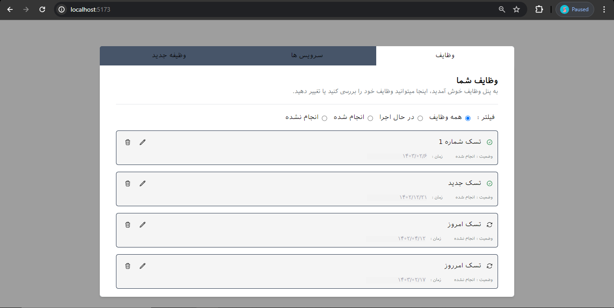
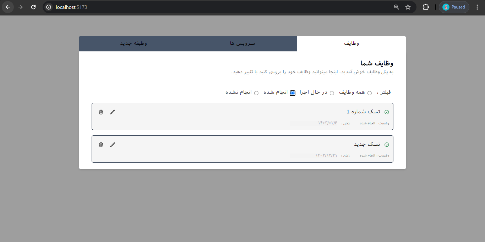
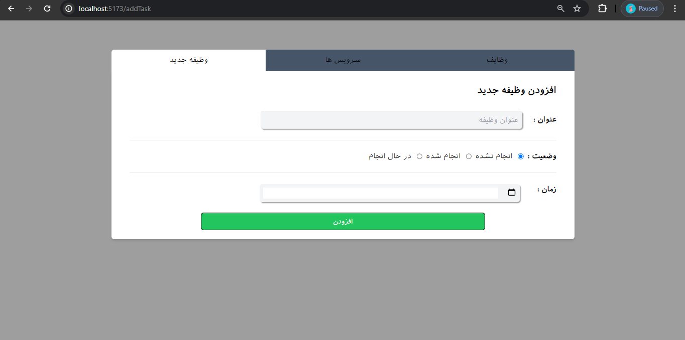
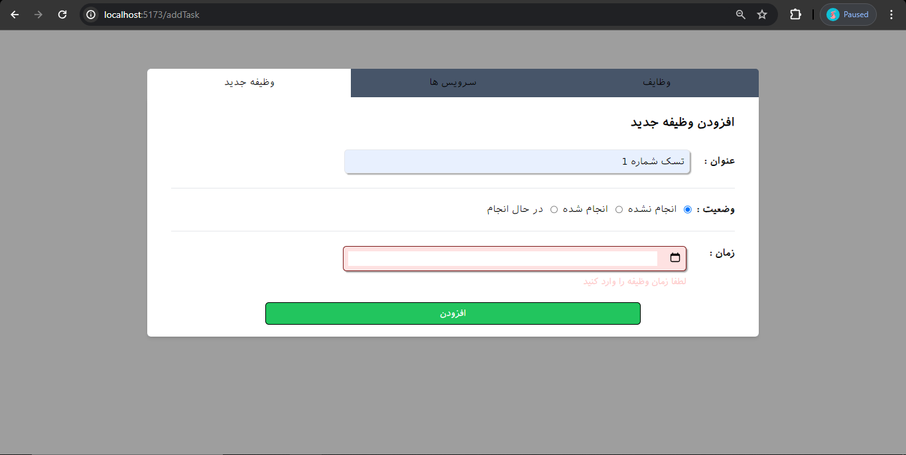
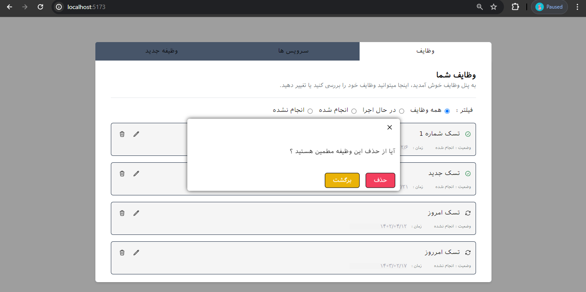
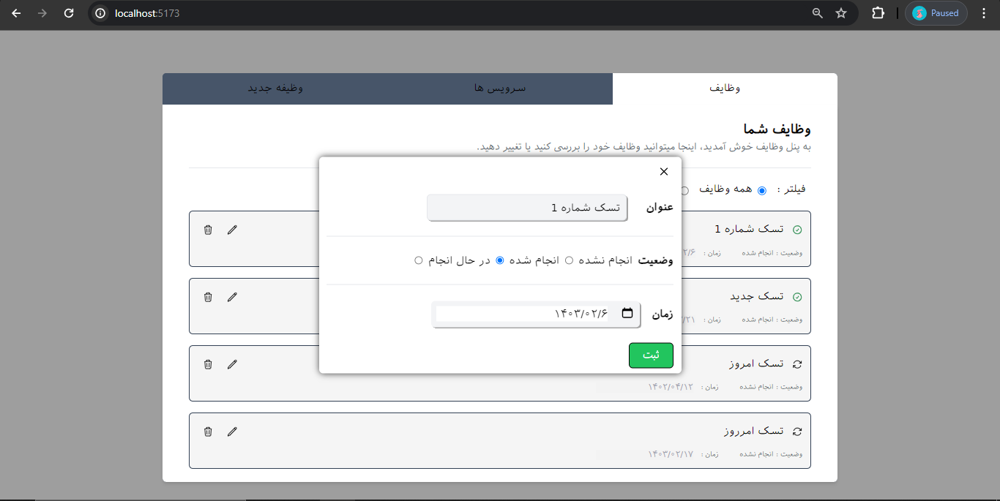
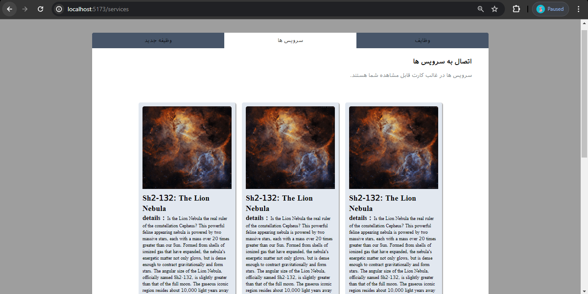

# Todo List

- This is a simple web Todo list application built with React.js .
- In tasks section it fetch data than a json-server api (its also in localhost , its in database.json).
- User can change or delete the tasks.
- For service section it fetch data from external API. 
- It's using tailwind-css for styling. 
- Routing is provided with react-router-dom packege.

 
# See Images
- Tasks :

- New task :

- Modals for editing and deleting : 

- Services that repeated 4 times : 
